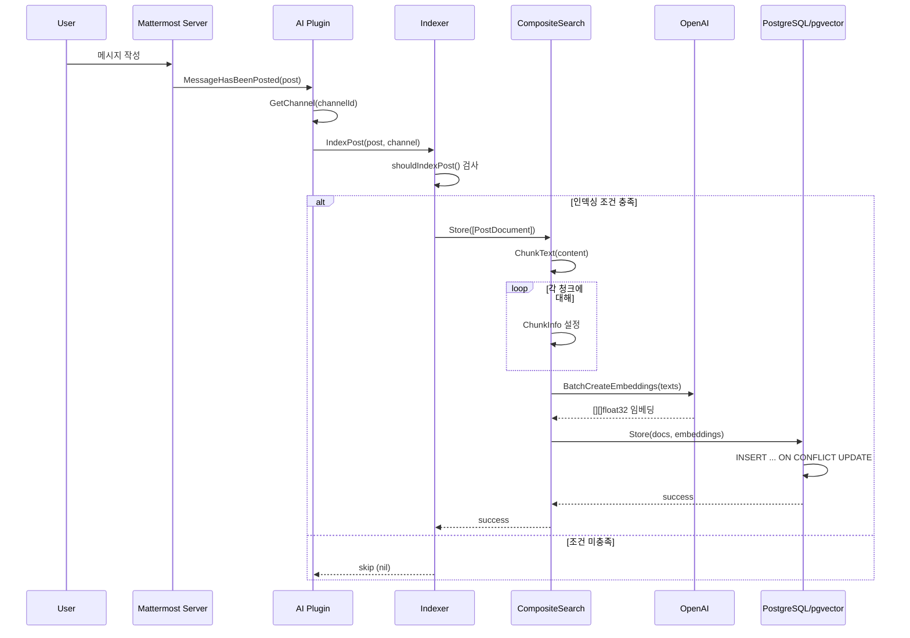
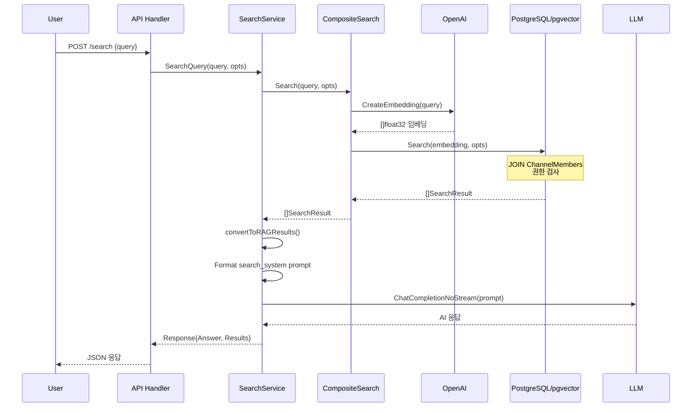
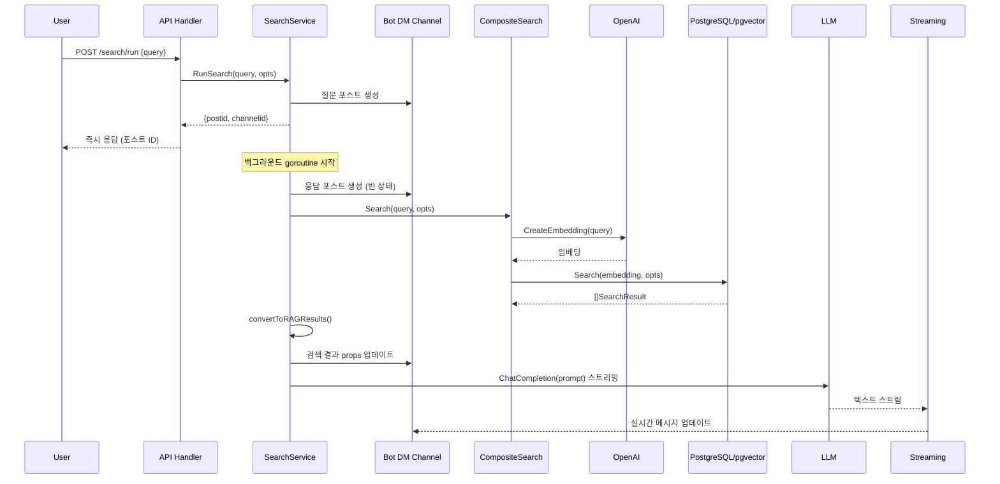

# 채널 대화 임베딩 프로세스 상세 문서

## 목차
1. [개요](#개요)
2. [아키텍처](#아키텍처)
3. [핵심 컴포넌트](#핵심-컴포넌트)
4. [포스트 인덱싱 프로세스](#포스트-인덱싱-프로세스)
5. [포스트 수정 및 삭제 처리](#포스트-수정-및-삭제-처리)
6. [시맨틱 검색 프로세스](#시맨틱-검색-프로세스)
7. [데이터베이스 스키마](#데이터베이스-스키마)
8. [API 엔드포인트](#api-엔드포인트)
9. [설정](#설정)
10. [시퀀스 다이어그램](#시퀀스-다이어그램)
11. [제약 사항 및 주의점](#제약-사항-및-주의점)

---

## 개요

Mattermost Agents 플러그인은 채널 대화 메시지를 벡터 임베딩으로 변환하여 PostgreSQL의 pgvector 확장을 사용해 저장합니다. 이를 통해 사용자는 자연어로 과거 대화 내용을 시맨틱 검색할 수 있습니다.

### 핵심 기능

| 기능 | 설명 |
|------|------|
| 실시간 인덱싱 | 새 메시지 작성 시 자동으로 임베딩 생성 및 저장 |
| 포스트 수정/삭제 동기화 | 메시지 수정/삭제 시 인덱스 자동 업데이트 |
| 텍스트 청킹 | 긴 메시지를 의미 단위로 분할 |
| 시맨틱 검색 | L2 거리 기반 벡터 유사도 검색 |
| 권한 기반 필터링 | 사용자가 접근 가능한 채널의 메시지만 검색 |
| RAG 응답 | 검색 결과를 기반으로 LLM이 답변 생성 |

### 전제 조건

| 조건 | 설명 |
|------|------|
| PostgreSQL + pgvector | pgvector 확장이 설치된 PostgreSQL 필요 |
| 라이선스 | `IsBasicsLicensed()` - 기본 라이선스 필요 |
| 임베딩 제공자 설정 | OpenAI API 키 등 임베딩 제공자 구성 필요 |

---

## 아키텍처

```
┌────────────────────────────────────────────────────────────────────────────┐
│                          Mattermost Server                                  │
│                                                                            │
│  ┌─────────────────┐                                                       │
│  │   User Posts    │──────────────┐                                        │
│  │   Message       │              │                                        │
│  └─────────────────┘              ▼                                        │
│                         ┌─────────────────┐                                │
│                         │ MessageHasBeenPosted │                           │
│                         │     (Plugin Hook)     │                          │
│                         └──────────┬──────┘                                │
└────────────────────────────────────┼───────────────────────────────────────┘
                                     │
                                     ▼
┌────────────────────────────────────────────────────────────────────────────┐
│                         AI Plugin (서버 사이드)                              │
│                                                                            │
│  ┌──────────────────────────────────────────────────────────────────────┐  │
│  │                         Indexer Service                               │  │
│  │  indexer/indexer.go                                                   │  │
│  │  ┌──────────────────┐                                                 │  │
│  │  │ shouldIndexPost  │ ◄── 인덱싱 조건 필터링                            │  │
│  │  │ - 빈 메시지 제외   │     (봇 메시지, 삭제된 포스트, 봇 DM 등 제외)        │  │
│  │  │ - 봇 메시지 제외   │                                                 │  │
│  │  │ - 시스템 포스트 제외│                                                 │  │
│  │  └────────┬─────────┘                                                 │  │
│  │           │                                                           │  │
│  │           ▼                                                           │  │
│  │  ┌──────────────────┐                                                 │  │
│  │  │   IndexPost      │ ◄── PostDocument 생성                            │  │
│  │  └────────┬─────────┘                                                 │  │
│  └───────────┼───────────────────────────────────────────────────────────┘  │
│              │                                                              │
│              ▼                                                              │
│  ┌──────────────────────────────────────────────────────────────────────┐  │
│  │                    CompositeSearch (EmbeddingSearch)                  │  │
│  │  embeddings/composite.go                                              │  │
│  │                                                                       │  │
│  │  ┌────────────────────────────────────────────────────────────────┐  │  │
│  │  │ Store() 메서드                                                   │  │  │
│  │  │                                                                  │  │  │
│  │  │  1. 텍스트 청킹                                                   │  │  │
│  │  │     ┌─────────────────────────────────────────┐                 │  │  │
│  │  │     │        Chunking Service                  │                 │  │  │
│  │  │     │  chunking/chunker.go                     │                 │  │  │
│  │  │     │  - sentences (기본): 문장 기반 분할         │                 │  │  │
│  │  │     │  - paragraphs: 문단 기반 분할             │                 │  │  │
│  │  │     │  - fixed: 고정 크기 분할                  │                 │  │  │
│  │  │     │  ChunkSize: 1000 (기본)                  │                 │  │  │
│  │  │     │  ChunkOverlap: 200 (기본)                │                 │  │  │
│  │  │     └──────────────────┬──────────────────────┘                 │  │  │
│  │  │                        │                                         │  │  │
│  │  │  2. 임베딩 생성         ▼                                         │  │  │
│  │  │     ┌─────────────────────────────────────────┐                 │  │  │
│  │  │     │      Embedding Provider (OpenAI)         │                 │  │  │
│  │  │     │  openai/openai.go                        │                 │  │  │
│  │  │     │  - CreateEmbedding() : 단일 텍스트        │                 │  │  │
│  │  │     │  - BatchCreateEmbeddings() : 배치 처리   │                 │  │  │
│  │  │     │  모델: text-embedding-3-large (기본)      │                 │  │  │
│  │  │     │  차원: 3072 (기본)                        │                 │  │  │
│  │  │     └──────────────────┬──────────────────────┘                 │  │  │
│  │  │                        │                                         │  │  │
│  │  │  3. 벡터 저장           ▼                                         │  │  │
│  │  │     ┌─────────────────────────────────────────┐                 │  │  │
│  │  │     │         VectorStore (PGVector)           │                 │  │  │
│  │  │     │  postgres/pgvector.go                    │                 │  │  │
│  │  │     │  - Store(): 임베딩 저장                   │                 │  │  │
│  │  │     │  - Search(): 유사도 검색                  │                 │  │  │
│  │  │     └─────────────────────────────────────────┘                 │  │  │
│  │  └────────────────────────────────────────────────────────────────┘  │  │
│  └──────────────────────────────────────────────────────────────────────┘  │
│                                                                            │
│                                      │                                     │
│                                      ▼                                     │
└──────────────────────────────────────────────────────────────────────────────┘
                                       │
                                       ▼
┌────────────────────────────────────────────────────────────────────────────┐
│                      PostgreSQL + pgvector                                  │
│                                                                            │
│  ┌──────────────────────────────────────────────────────────────────────┐  │
│  │                  llm_posts_embeddings 테이블                           │  │
│  │  - id: 포스트 ID 또는 청크 ID (post_id_chunk_N)                         │  │
│  │  - post_id: 원본 포스트 ID                                             │  │
│  │  - embedding: vector(3072) 타입                                       │  │
│  │  - content: 원본 텍스트                                                │  │
│  │  - is_chunk, chunk_index, total_chunks: 청킹 메타데이터                 │  │
│  │  - team_id, channel_id, user_id: 권한 검사용 메타데이터                  │  │
│  └──────────────────────────────────────────────────────────────────────┘  │
│                                                                            │
│  인덱스: HNSW (vector_l2_ops) - L2 거리 기반 유사도 검색                      │
└────────────────────────────────────────────────────────────────────────────┘
```

---

## 핵심 컴포넌트

### 1. Indexer Service (`indexer/indexer.go`)

포스트 인덱싱을 담당하는 서비스입니다.

```go
type Indexer struct {
    search    embeddings.EmbeddingSearch  // 임베딩 검색 인터페이스
    pluginAPI mmapi.Client                // Mattermost Plugin API
    bots      *bots.MMBots                // 봇 관리자
    db        *sqlx.DB                    // 데이터베이스 연결
}
```

**주요 메서드:**

| 메서드 | 설명 |
|--------|------|
| `IndexPost(ctx, post, channel)` | 단일 포스트 인덱싱 |
| `DeletePost(ctx, postID)` | 포스트 인덱스에서 삭제 |
| `StartReindexJob()` | 전체 재인덱싱 작업 시작 |
| `shouldIndexPost(post, channel)` | 인덱싱 조건 검사 |

### 2. CompositeSearch (`embeddings/composite.go`)

임베딩 생성, 저장, 검색을 조합하는 핵심 컴포넌트입니다.

```go
type CompositeSearch struct {
    store    VectorStore         // 벡터 저장소 (pgvector)
    provider EmbeddingProvider   // 임베딩 제공자 (OpenAI)
    options  chunking.Options    // 청킹 옵션
}
```

**주요 메서드:**

| 메서드 | 설명 |
|--------|------|
| `Store(ctx, docs)` | 문서 청킹 → 임베딩 생성 → 저장 |
| `Search(ctx, query, opts)` | 쿼리 임베딩 생성 → 유사도 검색 |
| `Delete(ctx, postIDs)` | 문서 및 청크 삭제 |
| `Clear(ctx)` | 전체 인덱스 삭제 |

### 3. EmbeddingProvider - OpenAI (`openai/openai.go`)

OpenAI API를 사용하여 텍스트를 벡터로 변환합니다.

```go
// 단일 텍스트 임베딩 생성
func (s *OpenAI) CreateEmbedding(ctx context.Context, text string) ([]float32, error)

// 배치 임베딩 생성 (효율적)
func (s *OpenAI) BatchCreateEmbeddings(ctx context.Context, texts []string) ([][]float32, error)
```

**구현 디테일:**

- OpenAI Embeddings API(`Embeddings.New`) 호출
- `embeddingModel`은 SDK 상수로 매핑되며, **커스텀 모델 문자열도 허용**
- `embeddingDimensions > 0`이면 API 요청에 `dimensions` 파라미터를 포함
- 응답 벡터는 `float64 → float32`로 변환

**지원 모델:**

| 모델 | 차원 | 설명 |
|------|------|------|
| `text-embedding-3-large` | 3072 | 기본 모델, 높은 정확도 |
| `text-embedding-3-small` | 1536 | 경량 모델 |
| `text-embedding-ada-002` | 1536 | 레거시 모델 |

### 3b. EmbeddingProvider - Mock (`embeddings/mock_provider.go`)

테스트/개발용 목 임베딩 제공자입니다. 입력 텍스트를 해시로 변환해 **결정론적 벡터**를 생성합니다.

- 기본 차원: 1536 (설정 차원이 없거나 0 이하일 때)
- 외부 API 호출 없음

### 4. VectorStore - PGVector (`postgres/pgvector.go`)

PostgreSQL pgvector 확장을 사용한 벡터 저장소입니다.

```go
type PGVector struct {
    db *sqlx.DB
}
```

**주요 메서드:**

| 메서드 | 설명 |
|--------|------|
| `Store(ctx, docs, embeddings)` | 문서와 임베딩 저장 |
| `Search(ctx, embedding, opts)` | 유사도 기반 검색 |
| `Delete(ctx, postIDs)` | 포스트 삭제 |
| `Clear(ctx)` | 테이블 비우기 |

### 5. Chunking Service (`chunking/chunker.go`)

긴 텍스트를 의미 단위로 분할합니다.

```go
type Options struct {
    ChunkSize        int     // 최대 청크 크기 (기본: 1000)
    ChunkOverlap     int     // 청크 간 겹침 (기본: 200)
    MinChunkSize     float64 // 최소 청크 크기 비율 (기본: 0.75, 현재 미사용)
    ChunkingStrategy string  // 전략: sentences, paragraphs, fixed
}
```

**청킹 전략:**

| 전략 | 분할 기준 |
|------|----------|
| `sentences` (기본) | `. `, `! `, `? `, `\n` |
| `paragraphs` | `\n\n`, `\n` |
| `fixed` | 공백, 빈 문자열 |

> **청킹 예외 처리**: 내용이 비어있거나 `chunkSize <= 0`, 또는 분할 결과가 원문 1개뿐이면 청킹하지 않고 `is_chunk = false`, `total_chunks = 1`로 저장됩니다.
> **Overlap 적용**: `chunkOverlap`은 모든 전략에서 공통으로 적용되며, 분할 시 인접 청크에 동일 문자열이 겹쳐질 수 있습니다.

### 6. Search Service (`search/search.go`)

검색 요청을 처리하고 RAG 응답을 생성합니다.

```go
type Search struct {
    embeddings.EmbeddingSearch
    mmclient         mmapi.Client
    prompts          *llm.Prompts
    streamingService streaming.Service
    licenseChecker   *enterprise.LicenseChecker
}
```

---

## 포스트 인덱싱 프로세스

### 단계별 흐름

```
사용자 메시지 작성
        │
        ▼
┌───────────────────────────────────────┐
│ 1. Plugin Hook 트리거                  │
│    server/main.go                     │
│    MessageHasBeenPosted()             │
└───────────────────┬───────────────────┘
                    │
                    ▼
┌───────────────────────────────────────┐
│ 2. 채널 정보 조회                       │
│    p.API.GetChannel(post.ChannelId)   │
└───────────────────┬───────────────────┘
                    │
                    ▼
┌───────────────────────────────────────┐
│ 3. 인덱싱 조건 검사                     │
│    indexer.shouldIndexPost()          │
│    - 빈 메시지? → 제외                  │
│    - 봇 메시지? → 제외                  │
│    - 시스템 포스트? → 제외              │
│    - 삭제된 포스트? → 제외              │
│    - 봇 DM 채널? → 제외                 │
└───────────────────┬───────────────────┘
                    │ (조건 통과)
                    ▼
┌───────────────────────────────────────┐
│ 4. PostDocument 생성                   │
│    embeddings.PostDocument{           │
│      PostID, CreateAt, TeamID,        │
│      ChannelID, UserID, Content       │
│    }                                  │
└───────────────────┬───────────────────┘
                    │
                    ▼
┌───────────────────────────────────────┐
│ 5. CompositeSearch.Store() 호출        │
│    embeddings/composite.go            │
└───────────────────┬───────────────────┘
                    │
        ┌───────────┴───────────┐
        ▼                       │
┌─────────────────┐             │
│ 5a. 텍스트 청킹  │             │
│ ChunkText()     │             │
│ - ChunkSize     │             │
│ - ChunkOverlap  │             │
│ - Strategy      │             │
└────────┬────────┘             │
         │                      │
         ▼                      │
┌─────────────────┐             │
│ 5b. 청크별      │             │
│ ChunkInfo 설정  │             │
│ - IsChunk       │             │
│ - ChunkIndex    │             │
│ - TotalChunks   │             │
└────────┬────────┘             │
         │                      │
         └──────────────────────┤
                                │
                                ▼
┌───────────────────────────────────────┐
│ 6. 임베딩 생성                          │
│    OpenAI.BatchCreateEmbeddings()     │
│    - 모든 청크 텍스트 배치 전송          │
│    - API: POST embeddings             │
│    - 모델: text-embedding-3-large     │
│    - 결과: [][]float32 (3072 차원)     │
└───────────────────┬───────────────────┘
                    │
                    ▼
┌───────────────────────────────────────┐
│ 7. 벡터 저장                           │
│    PGVector.Store()                   │
│    - INSERT INTO llm_posts_embeddings │
│    - ON CONFLICT DO UPDATE            │
│    - pgvector.NewVector(embedding)    │
└───────────────────┬───────────────────┘
                    │
                    ▼
              완료 ✓
```

### 임베딩 생성 및 저장 상세

`CompositeSearch.Store()` 내부 동작:

1. **청킹 적용**: `chunking.ChunkText()`로 텍스트를 청크 배열로 변환  
   - 청크 결과가 1개뿐이면 `is_chunk=false`로 저장
2. **배치 임베딩 생성**: 모든 청크 텍스트를 `BatchCreateEmbeddings()`로 **한 번에** 요청
3. **벡터 저장**: `PGVector.Store()`가 각 청크를 `llm_posts_embeddings`에 INSERT
   - 청크 ID: `{post_id}_chunk_{index}`
   - 비청킹 ID: `{post_id}`
   - `ON CONFLICT (id)` 시 **content/embedding/청크 메타**만 갱신
   - `created_at`은 포스트 생성 시각(`Post.CreateAt`)을 저장하며, 인덱싱 시각은 별도로 저장하지 않습니다.

### 인덱싱 조건 (`shouldIndexPost`)

> **주의**: 임베딩 검색이 설정되지 않은 경우(`search == nil`), 인덱싱은 수행되지 않습니다.

```go
func (s *Indexer) shouldIndexPost(post *model.Post, channel *model.Channel) bool {
    // 1. 빈 메시지 제외
    if post.Message == "" {
        return false
    }
    
    // 2. 봇 메시지 제외
    if s.bots.IsAnyBot(post.UserId) {
        return false
    }
    
    // 3. 일반 포스트만 허용 (시스템 메시지 제외)
    if post.Type != model.PostTypeDefault {
        return false
    }
    
    // 4. 삭제된 포스트 제외
    if post.DeleteAt != 0 {
        return false
    }
    
    // 5. 봇 DM 채널 제외
    if channel != nil && s.bots.GetBotForDMChannel(channel) != nil {
        return false
    }
    
    return true
}
```

---

## 포스트 수정 및 삭제 처리

플러그인은 포스트 수정 및 삭제 시에도 인덱스를 동기화합니다.

### MessageHasBeenUpdated 훅

포스트가 수정되면 기존 임베딩을 삭제하고 새로운 내용으로 다시 인덱싱합니다.

```go
func (p *Plugin) MessageHasBeenUpdated(c *plugin.Context, newPost, oldPost *model.Post) {
    if p.indexerService != nil {
        // 1. 기존 포스트 인덱스에서 삭제
        if err := p.indexerService.DeletePost(context.Background(), oldPost.Id); err != nil {
            p.pluginAPI.Log.Error("Failed to delete post from vector database", "error", err)
        }

        // 2. 채널 정보 조회
        channel, err := p.API.GetChannel(newPost.ChannelId)
        if err != nil {
            p.pluginAPI.Log.Error("Failed to get channel for post indexing", "error", err)
        } else {
            // 3. 수정된 포스트 다시 인덱싱
            if err := p.indexerService.IndexPost(context.Background(), newPost, channel); err != nil {
                p.pluginAPI.Log.Error("Failed to index updated post in vector database", "error", err)
            }
        }
    }
}
```

### MessageHasBeenDeleted 훅

포스트가 삭제되면 인덱스에서도 해당 포스트를 제거합니다.

```go
func (p *Plugin) MessageHasBeenDeleted(c *plugin.Context, post *model.Post) {
    if p.indexerService != nil {
        if err := p.indexerService.DeletePost(context.Background(), post.Id); err != nil {
            p.pluginAPI.Log.Error("Failed to delete post from vector database", "error", err)
        }
    }
}
```

### 삭제 처리 흐름

```
포스트 삭제/수정
        │
        ▼
┌───────────────────────────────────────┐
│ Plugin Hook 트리거                     │
│ MessageHasBeenDeleted/Updated         │
└───────────────────┬───────────────────┘
                    │
                    ▼
┌───────────────────────────────────────┐
│ Indexer.DeletePost(postID)            │
└───────────────────┬───────────────────┘
                    │
                    ▼
┌───────────────────────────────────────┐
│ CompositeSearch.Delete([postID])      │
└───────────────────┬───────────────────┘
                    │
                    ▼
┌───────────────────────────────────────┐
│ PGVector.Delete()                     │
│ DELETE FROM llm_posts_embeddings      │
│ WHERE post_id IN (...)                │
│ (청크 포함 모두 삭제)                   │
└───────────────────────────────────────┘
```

> **참고**: `post_id` 컬럼에 인덱스가 있어 청크를 포함한 모든 관련 레코드가 효율적으로 삭제됩니다.

---

## 시맨틱 검색 프로세스

### 검색 흐름

```
사용자 검색 요청
        │
        ▼
┌───────────────────────────────────────┐
│ 1. API 요청 수신                        │
│    POST /search (동기)                 │
│    또는 POST /search/run (비동기)       │
│    api/api_search.go                  │
└───────────────────┬───────────────────┘
                    │
                    ▼
┌───────────────────────────────────────┐
│ 2. 요청 파싱                            │
│    SearchRequest {                    │
│      Query: "검색어",                   │
│      TeamID: "팀 ID",                  │
│      ChannelID: "채널 ID" (선택),       │
│      MaxResults: 5 (기본)              │
│    }                                  │
└───────────────────┬───────────────────┘
                    │
                    ▼
┌───────────────────────────────────────┐
│ 3. 쿼리 임베딩 생성                      │
│    CompositeSearch.Search()           │
│    OpenAI.CreateEmbedding(query)      │
│    → []float32 (3072 차원)             │
└───────────────────┬───────────────────┘
                    │
                    ▼
┌───────────────────────────────────────┐
│ 4. 유사도 검색 (pgvector)               │
│    PGVector.Search()                  │
│    - 권한 검사 JOIN                     │
│    - L2 거리 (<-> 연산자)               │
│    - ORDER BY similarity ASC          │
│    - LIMIT maxResults                 │
└───────────────────┬───────────────────┘
                    │
                    ▼
┌───────────────────────────────────────┐
│ 5. 결과 변환                            │
│    convertToRAGResults()              │
│    - 채널명 조회                        │
│    - 사용자명 조회                      │
│    - 청크 정보 포함                     │
└───────────────────┬───────────────────┘
                    │
                    ▼
┌───────────────────────────────────────┐
│ 6. RAG 응답 생성                        │
│    search_system.tmpl 프롬프트         │
│    + 검색 결과 컨텍스트                  │
│    → LLM ChatCompletion               │
└───────────────────┬───────────────────┘
                    │
                    ▼
┌───────────────────────────────────────┐
│ 7. 응답 반환                            │
│    Response {                         │
│      Answer: "AI 생성 답변",            │
│      Results: [RAGResult...]          │
│    }                                  │
└───────────────────────────────────────┘
```

### 검색 처리 상세

- `SearchOptions.UserID`는 필수이며, 없으면 검색이 실패합니다.
- `Limit`은 `1 <= Limit < 100000`인 경우에만 SQL `LIMIT`이 적용됩니다.
- `MinScore`는 SQL 결과를 가져온 뒤 애플리케이션 레벨에서 필터링됩니다.
- `TeamID/ChannelID/CreatedAfter/CreatedBefore`는 값이 있을 때만 WHERE 조건에 추가됩니다.
- 시간 필터는 `llm_posts_embeddings.created_at`(포스트 생성 시각) 기준입니다.

### 청크 결과 처리

- 검색은 `llm_posts_embeddings`의 **청크 단위 레코드**를 그대로 반환합니다. 동일 `post_id`가 여러 번 나올 수 있으며 현재 **중복 제거/병합 로직은 없습니다**.  
- `convertToRAGResults()`에서 청크 정보는 채널명 뒤에 `"(Chunk x of y)"` 형태로 붙어 전달됩니다.

### 검색 옵션 (SearchOptions)

```go
type SearchOptions struct {
    Limit         int     // 최대 결과 수 (기본: 5, 1~99999만 LIMIT 적용)
    MinScore      float32 // 최소 유사도 점수 (0.0 ~ 1.0)
    TeamID        string  // 팀 필터 (선택)
    ChannelID     string  // 채널 필터 (선택)
    UserID        string  // 권한 검사용 사용자 ID (필수)
    CreatedAfter  int64   // 이 시간 이후 생성된 포스트만 (Unix ms timestamp, 선택)
    CreatedBefore int64   // 이 시간 이전 생성된 포스트만 (Unix ms timestamp, 선택)
}
```

> **주의**: `MinScore` 필터는 쿼리 결과를 가져온 후 애플리케이션 레벨에서 적용됩니다. `LIMIT`이 먼저 적용되므로, 조건이 엄격하면 결과 수가 `Limit`보다 적을 수 있습니다.

### 유사도 계산 방식

pgvector의 L2 거리 연산자 `<->`를 사용하여 유사도를 계산합니다:

```
L2 거리 (distance) = embedding <-> query_embedding
스코어 (score) = max(0, 1 - distance)
```

- L2 거리가 0에 가까울수록 유사함
- 스코어는 0~1 범위로 클램프됨 (1에 가까울수록 유사)
- `MinScore` 옵션으로 낮은 스코어 결과 필터링 가능

### 권한 기반 검색 쿼리

```sql
SELECT
    e.post_id,
    e.team_id,
    e.channel_id,
    e.user_id,
    e.created_at,
    e.content,
    e.is_chunk,
    e.chunk_index,
    e.total_chunks,
    (e.embedding <-> $1) as similarity  -- L2 거리
FROM llm_posts_embeddings e
JOIN Channels c ON e.channel_id = c.Id
JOIN ChannelMembers cm ON e.channel_id = cm.ChannelId  -- 권한 검사
JOIN Posts p ON e.post_id = p.Id
WHERE cm.UserId = $2           -- 사용자가 멤버인 채널만
  AND c.DeleteAt = 0           -- 삭제되지 않은 채널
  AND p.DeleteAt = 0           -- 삭제되지 않은 포스트
  AND e.team_id = $3           -- (선택) 팀 필터
  AND e.channel_id = $4        -- (선택) 채널 필터
  AND e.created_at > $5        -- (선택) 시간 필터 (CreatedAfter, Unix ms)
  AND e.created_at < $6        -- (선택) 시간 필터 (CreatedBefore, Unix ms)
ORDER BY similarity ASC         -- L2 거리 낮은 순 (유사도 높은 순)
LIMIT $7
```

> **스코어 변환**: 쿼리 결과에서 `score = max(0, 1 - similarity)`로 변환하며, `score < MinScore`인 결과는 필터링됩니다. (`similarity`는 L2 거리)

---

## 데이터베이스 스키마

### llm_posts_embeddings 테이블

```sql
CREATE TABLE IF NOT EXISTS llm_posts_embeddings (
    -- 기본 키: 포스트 ID 또는 청크 ID (post_id_chunk_N)
    id TEXT PRIMARY KEY,
    
    -- 원본 포스트 참조 (CASCADE 삭제)
    post_id TEXT NOT NULL REFERENCES Posts(Id) ON DELETE CASCADE,
    
    -- 메타데이터
    team_id TEXT NOT NULL,
    channel_id TEXT NOT NULL,
    user_id TEXT NOT NULL,
    content TEXT NOT NULL,
    created_at BIGINT NOT NULL,
    
    -- 벡터 임베딩 (차원은 설정에 따라 변경)
    embedding vector(3072),
    
    -- 청킹 정보
    is_chunk BOOLEAN NOT NULL DEFAULT FALSE,
    chunk_index INTEGER,       -- NULL for non-chunks
    total_chunks INTEGER       -- NULL for non-chunks
);

-- HNSW 인덱스 (유사도 검색 성능 최적화)
CREATE INDEX IF NOT EXISTS llm_posts_embeddings_embedding_idx 
    ON llm_posts_embeddings USING hnsw (embedding vector_l2_ops);

-- post_id 인덱스 (삭제/조회 성능)
CREATE INDEX IF NOT EXISTS llm_posts_embeddings_post_id_idx 
    ON llm_posts_embeddings(post_id);

-- is_chunk 인덱스 (필터링 성능)
CREATE INDEX IF NOT EXISTS llm_posts_embeddings_is_chunk_idx 
    ON llm_posts_embeddings(is_chunk);
```

### 청크 ID 규칙

| 포스트 유형 | ID 형식 | 예시 |
|------------|---------|------|
| 청킹되지 않은 포스트 | `{post_id}` | `abc123` |
| 청킹된 포스트 (첫 번째) | `{post_id}_chunk_0` | `abc123_chunk_0` |
| 청킹된 포스트 (두 번째) | `{post_id}_chunk_1` | `abc123_chunk_1` |

---

## API 엔드포인트

> **기본 경로**: `/plugins/mattermost-ai/`

### 검색 API

#### 1. 시맨틱 검색 (SearchQuery - 동기)

```
POST /plugins/mattermost-ai/search?botUsername={botUsername}
```

검색을 수행하고 즉시 결과를 반환합니다. LLM을 사용해 검색 결과 기반 답변을 생성합니다.

**요청:**
```json
{
    "query": "프로젝트 일정 관련 논의",
    "teamId": "team123",
    "channelId": "channel456",  // 선택
    "maxResults": 10            // 기본: 5
}
```

**응답:**
```json
{
    "answer": "AI가 생성한 답변...",
    "results": [
        {
            "postId": "post789",
            "channelId": "channel456",
            "channelName": "Town Square",
            "userId": "user123",
            "username": "john.doe",
            "content": "메시지 내용...",
            "score": 0.85
        }
    ]
}
```

#### 2. 검색 실행 (RunSearch - 비동기, DM 응답)

```
POST /plugins/mattermost-ai/search/run?botUsername={botUsername}
```

검색을 백그라운드에서 실행하고, 결과를 봇 DM으로 스트리밍합니다. 프론트엔드에서 사용자에게 즉시 피드백을 주고 싶을 때 사용합니다.

**요청:** 동일

**응답:**
```json
{
    "postid": "question_post_id",
    "channelid": "dm_channel_id"
}
```

**SearchQuery vs RunSearch 차이점:**

| 특성 | SearchQuery (`/search`) | RunSearch (`/search/run`) |
|------|-------------------------|---------------------------|
| 응답 방식 | 동기 (즉시 응답) | 비동기 (DM으로 응답) |
| 사용 사례 | API 연동, 프로그래밍 방식 | 사용자 인터랙션 |
| 응답 위치 | API 응답 | 봇 DM 채널 |
| 스트리밍 | 미지원 | 지원 (실시간 응답) |

### 관리자 API

> **인증**: 시스템 관리자 권한 (`PermissionManageSystem`) 필요

#### 1. 전체 재인덱싱 시작

```
POST /plugins/mattermost-ai/admin/reindex
```

**응답 (성공):**
```json
{
    "status": "running",
    "started_at": "2026-01-15T10:00:00Z",
    "processed_rows": 0,
    "total_rows": 10000
}
```

**응답 (이미 실행 중 - 409 Conflict):**
```json
{
    "status": "running",
    "started_at": "2026-01-15T09:00:00Z",
    "processed_rows": 5000,
    "total_rows": 10000
}
```

#### 2. 재인덱싱 상태 조회

```
GET /plugins/mattermost-ai/admin/reindex/status
```

**응답 (실행 중):**
```json
{
    "status": "running",
    "started_at": "2026-01-15T10:00:00Z",
    "processed_rows": 1500,
    "total_rows": 10000
}
```

**응답 (완료):**
```json
{
    "status": "completed",
    "started_at": "2026-01-15T10:00:00Z",
    "completed_at": "2026-01-15T10:15:00Z",
    "processed_rows": 10000,
    "total_rows": 10000
}
```

**응답 (작업 없음 - 404):**
```json
{
    "status": "no_job"
}
```

#### 3. 재인덱싱 취소

```
POST /plugins/mattermost-ai/admin/reindex/cancel
```

**응답 (성공):**
```json
{
    "status": "canceled",
    "started_at": "2026-01-15T10:00:00Z",
    "completed_at": "2026-01-15T10:05:00Z",
    "processed_rows": 3000,
    "total_rows": 10000
}
```

### 재인덱싱 작업 상태

| 상태 | 설명 |
|------|------|
| `running` | 재인덱싱 진행 중 |
| `completed` | 성공적으로 완료 |
| `failed` | 오류로 인해 실패 |
| `canceled` | 사용자에 의해 취소됨 |

---

## 설정

### 초기화 흐름

임베딩 검색 시스템은 플러그인 활성화 시 `server/main.go`의 `OnActivate()`에서 초기화됩니다:

```go
// server/main.go
embeddingsSearch, err := search.InitEmbeddingsSearch(
    dbClient.DB,
    llmUpstreamHTTPClient,
    p.configuration.EmbeddingSearchConfig(),
    licenseChecker,
)
```

`InitEmbeddingsSearch()` 함수는 `search/embeddings.go`에 정의되어 있으며:
1. 설정이 비어있으면 에러 반환 (검색 비활성화)
2. 라이선스 검사 수행
3. VectorStore (pgvector) 생성
4. EmbeddingProvider (OpenAI) 생성
5. CompositeSearch 인스턴스 반환

> **오류 처리**: 초기화 실패 시 로그만 남기고 플러그인은 계속 동작하며, 검색/인덱싱 기능은 비활성화됩니다.

### EmbeddingSearchConfig

플러그인 설정 JSON 내 `embeddingSearchConfig` 필드:

```json
{
    "embeddingSearchConfig": {
        "type": "composite",
        "dimensions": 3072,
        "vectorStore": {
            "type": "pgvector",
            "parameters": {
                "dimensions": 3072
            }
        },
        "embeddingProvider": {
            "type": "openai",
            "parameters": {
                "apiKey": "sk-...",
                "embeddingModel": "text-embedding-3-large",
                "embeddingDimensions": 3072
            }
        },
        "chunkingOptions": {
            "chunkSize": 1000,
            "chunkOverlap": 200,
            "minChunkSize": 0.75,
            "chunkingStrategy": "sentences"
        }
    }
}
```

> **차원 적용 규칙**: `dimensions`는 임베딩 제공자에 강제로 적용되며, `vectorStore.parameters.dimensions`가 있으면 pgvector 테이블 차원은 그 값을 사용합니다.

### 설정 옵션

| 옵션 | 타입 | 기본값 | 설명 |
|------|------|--------|------|
| `type` | string | - | `composite` (현재 유일한 타입) |
| `dimensions` | int | 3072 | 임베딩 벡터 차원 |
| `vectorStore.type` | string | - | `pgvector` |
| `embeddingProvider.type` | string | - | `openai`, `openai-compatible`, `mock` |
| `chunkingOptions.chunkSize` | int | 1000 | 최대 청크 크기 (문자) |
| `chunkingOptions.chunkOverlap` | int | 200 | 청크 간 겹침 |
| `chunkingOptions.minChunkSize` | float | 0.75 | 최소 청크 크기 비율 (현재 미사용) |
| `chunkingOptions.chunkingStrategy` | string | sentences | `sentences`, `paragraphs`, `fixed` |

### 임베딩 제공자 타입

| 타입 | 설명 | 필수 파라미터 |
|------|------|--------------|
| `openai` | OpenAI 공식 API | `apiKey` |
| `openai-compatible` | OpenAI 호환 API (Mistral 등) | `apiKey`, `apiURL` |
| `mock` | 테스트용 목 제공자 | 없음 |

> **기본값**: `openai`/`openai-compatible`에서 `embeddingModel`이 비어 있으면 `text-embedding-3-large`가 사용되며, 차원은 3072로 설정됩니다.

---

## 시퀀스 다이어그램

### 포스트 인덱싱 시퀀스



### 시맨틱 검색 시퀀스 (SearchQuery - 동기)



### 시맨틱 검색 시퀀스 (RunSearch - 비동기)



---

## 관련 파일

| 파일 | 설명 |
|------|------|
| `server/main.go` | 플러그인 초기화, 훅 등록 (MessageHasBeenPosted/Updated/Deleted) |
| `indexer/indexer.go` | 인덱싱 서비스 |
| `indexer/indexer_job.go` | 재인덱싱 백그라운드 작업 |
| `embeddings/embeddings.go` | 임베딩 인터페이스 및 타입 정의 |
| `embeddings/composite.go` | 복합 검색 구현 (청킹 + 임베딩 + 저장) |
| `openai/openai.go` | OpenAI 임베딩 제공자 |
| `postgres/pgvector.go` | pgvector 벡터 저장소 |
| `chunking/chunker.go` | 텍스트 청킹 |
| `search/search.go` | 검색 서비스 (RAG 응답 생성) |
| `search/embeddings.go` | 검색 서비스 초기화 (`InitEmbeddingsSearch`) |
| `api/api_search.go` | 검색 API 핸들러 |
| `api/api_admin.go` | 관리자 API 핸들러 (재인덱싱) |
| `prompts/search_system.tmpl` | 검색 시스템 프롬프트 (RAG 컨텍스트) |
| `prompts/search_results.tmpl` | 검색 결과 포맷팅 템플릿 |
| `config/config.go` | 플러그인 설정 (EmbeddingSearchConfig) |
| `enterprise/license.go` | 라이선스 검사 |

---

## 성능 고려사항

### HNSW 인덱스

- **알고리즘**: Hierarchical Navigable Small World
- **장점**: 빠른 근사 최근접 이웃 검색
- **단점**: 인덱스 빌드 시간, 메모리 사용량 증가

### 배치 처리

- `BatchCreateEmbeddings()` 사용으로 API 호출 최소화
- 재인덱싱 시 100개 포스트 단위 배치 처리
- 재인덱싱 진행 상황은 500개마다 KV 스토어에 저장

### 권한 필터링

- 검색 시 `ChannelMembers` JOIN으로 권한 검사
- 사용자가 접근 가능한 채널의 메시지만 반환
- 삭제된 채널/포스트 자동 필터링

---

## 제약 사항 및 주의점

### 검색 결과 중복/디듀프 정책 (FAQ)

**Q. 검색 결과에 동일 포스트가 여러 번 나오나요?**  
A. 네. 현재는 **청크 단위 결과를 그대로 반환**하며 `post_id` 기준 병합/디듀프가 없습니다.

**Q. 스코어는 어떻게 취급되나요?**  
A. 청크별 스코어를 그대로 사용합니다. 포스트 단위로 재정렬/집계하지 않습니다.

**Q. 결과 수 제한과 어떤 상호작용이 있나요?**  
A. `LIMIT`이 **청크 단위**로 적용되므로 동일 포스트 청크가 많이 매칭되면 실제 서로 다른 포스트 수는 `Limit`보다 적을 수 있습니다.  
또한 `MinScore`는 SQL 결과 이후 적용되어, `Limit`보다 더 적은 결과가 반환될 수 있습니다.

**Q. UI/프롬프트에서는 어떻게 표시되나요?**  
A. `convertToRAGResults()`에서 `ChannelName` 뒤에 `(Chunk x of y)`가 붙어 청크임을 표시하며,  
`search_results.tmpl`에는 **청크별 메시지**가 그대로 전달됩니다.

> **향후 개선 포인트**: 포스트 단위로 병합하려면 `post_id` 기준으로 최고 스코어 청크만 남기거나, 청크를 합쳐 요약하는 별도 로직이 필요합니다.

### 라이선스 요구사항

임베딩 검색 기능은 라이선스가 필요합니다:

```go
// search/embeddings.go
if !licenseChecker.IsBasicsLicensed() {
    return nil, fmt.Errorf("search is unavailable without a valid license")
}
```

### 인덱싱 제외 대상

다음 유형의 메시지는 인덱싱되지 않습니다:

| 제외 대상 | 이유 |
|----------|------|
| 빈 메시지 | 검색 가치 없음 |
| 봇 메시지 | AI 응답은 인덱싱 불필요 |
| 시스템 포스트 | 가입/탈퇴 등 시스템 메시지 |
| 삭제된 포스트 | DeleteAt > 0 |
| 봇 DM 채널 메시지 | AI 대화는 별도 관리 |

### 검색 결과 프롬프트 템플릿

검색 결과는 `search_results.tmpl` 템플릿을 통해 LLM에 전달됩니다:

```
{{range .Parameters.Results}}<message from="{{.Username}}" in="{{.ChannelName}}" relevance="{{printf "%.2f" .Score}}">
{{.Content}}
</message>

{{end}}
```

> `relevance`는 소수 둘째 자리까지 포맷됩니다.

### 임베딩 차원 불일치 주의

> ⚠️ **중요**: 임베딩 차원을 변경하면 기존 인덱스와 호환되지 않습니다. 차원 변경 시 전체 재인덱싱이 필요합니다.  
> 또한 **임베딩 제공자 차원과 pgvector 테이블 차원이 일치하지 않으면** 저장 단계에서 오류가 발생할 수 있습니다.

### 재인덱싱 시 주의사항

1. **기존 인덱스 삭제**: 재인덱싱 시작 시 `Clear()`로 기존 인덱스가 모두 삭제됩니다
2. **API 호출 비용**: 대량의 포스트 재인덱싱 시 OpenAI API 비용 발생
3. **동시 실행 불가**: 한 번에 하나의 재인덱싱 작업만 실행 가능
4. **취소 시 부분 손실**: 취소 시 일부 포스트만 인덱싱된 상태로 남을 수 있음
5. **필터 적용 위치**: SQL에서 `DeleteAt = 0`, `Message != ''`, `Type = ''`을 선필터링한 뒤, `shouldIndexPost()`로 봇/봇 DM 등을 추가 필터링합니다.

### pgvector 확장 필수

```sql
-- PostgreSQL에 pgvector 확장이 설치되어 있어야 함
CREATE EXTENSION IF NOT EXISTS vector;
```

확장이 없으면 테이블 생성 및 검색이 실패합니다.

---

*마지막 업데이트: 2026-01-15*
